```{r setup, include=FALSE}
knitr::opts_chunk$set(echo = TRUE)
```

<p style="text-align: justify;">
Abaixo segue um passo a passo de como criar uma página pessoal ou profissional usando o GitHub e os temas do Jeckyll themes. 
</p>
 
<p style="text-align: justify;">
Primeiro vamos criar uma conta no GitHub, nesse caso, é melhor, sempre que for possível utilizar o e-mail acadêmico, pois assim você consegue alguns privilégios em sua conta gratuita. Além disso, sugiro no username, não usar palavrão, ou termos chulos, usar uma palavra pequena, não use muitos números e tente não usar caracteres especiais.
</p>


```{r, out.width = "1000px", fig.align='center'}

```

<p style="text-align: justify;">
Após inserir seu username, seu e-mail e sua senha a próxima etapa é a verificação de conta:
</p>

```{r, out.width = "1000px", fig.align='center'}
knitr::include_graphics("Figuras/Fig2.png")
```

Escolha o melhor plano para você, sempre usei o gratuito :)

```{r, out.width = "1000px", fig.align='center'}
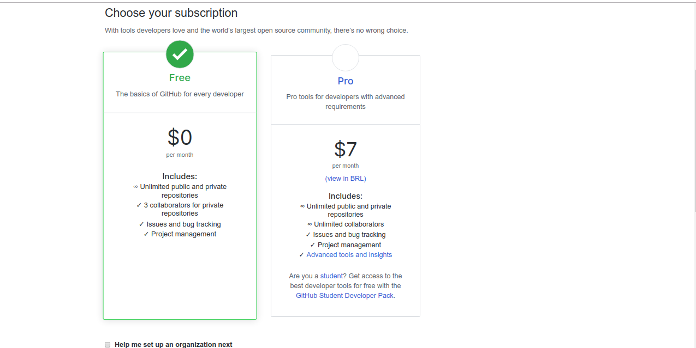
```

Vá até sua caixa de e-mail e clique em verificar conta:

```{r, out.width = "1000px", fig.align='center'}
knitr::include_graphics("Figuras/Fig4.png")
```

Após isso, sua conta já estará confirmada!

```{r, out.width = "1000px", fig.align='center'}
knitr::include_graphics("Figuras/Fig5.png")
```

Agora vá até o link <https://cran.r-project.org/>, baixe o R e o instale.

```{r, out.width = "1000px", fig.align='center'}
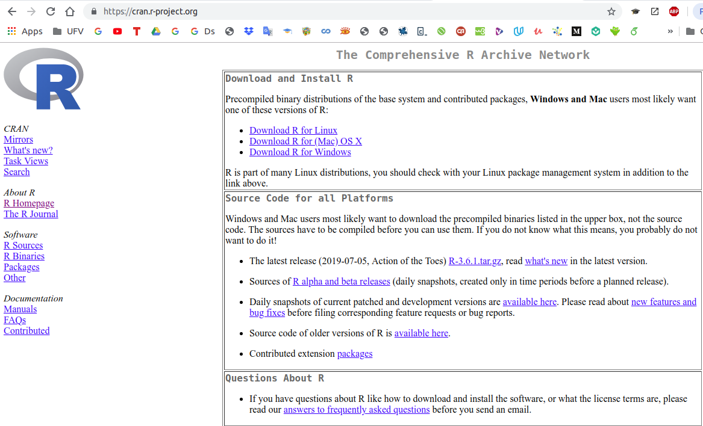
```

Baixe no link <https://www.rstudio.com/products/rstudio/> o Rstudio e o instale.

```{r, out.width = "1000px", fig.align='center'}
knitr::include_graphics("Figuras/Fig7.png")
```

Baixe no link <https://git-scm.com/downloads> o git para seu sistema operacional e o instale. 

```{r, out.width = "1000px", fig.align='center'}
knitr::include_graphics("Figuras/Fig8.png")
```

<p style="text-align: justify;">
Agora, volte ao GitHub e crie seu primeiro repositório. Como vamos criar uma página, seu repositório deverá ter o seguinte nome: username.github.io, onde username deve ser o seu nome de usuário da conta do GitHub.
</p> 

```{r, out.width = "1000px", fig.align='center'}
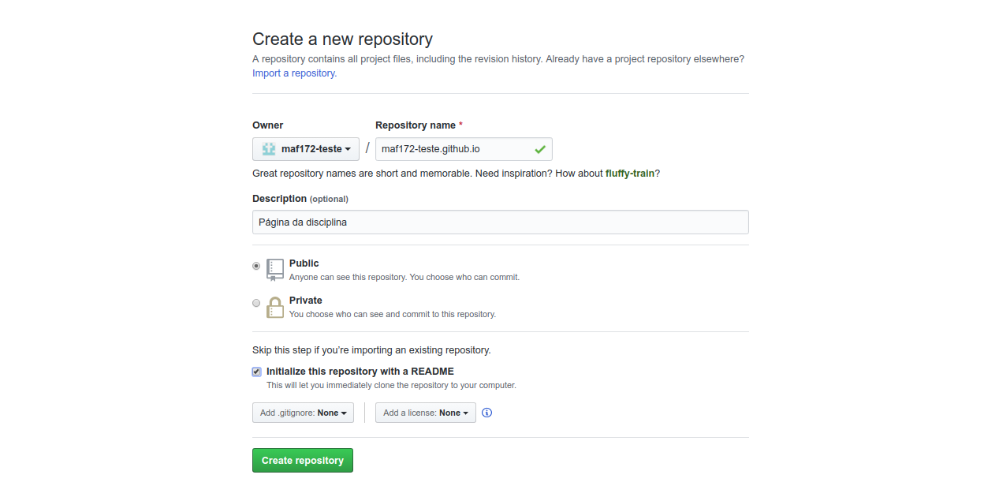
```

Agora, abra o Rstudio

```{r, out.width = "1000px", fig.align='center'}
knitr::include_graphics("Figuras/Fig10.png")
```

Clique em "Tools", depois em "global options", em seguida em "Git/SVN" e depois em create RSA Key

```{r, out.width = "1000px", fig.align='center'}
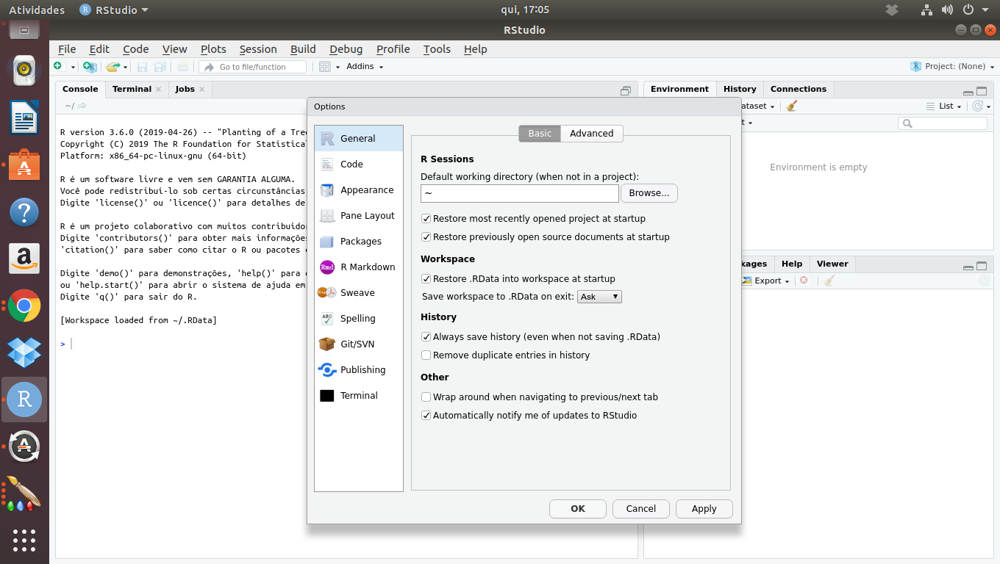
```

Em seguida clique em criar, não é necessário adicionar nenhuma senha.

```{r, out.width = "1000px", fig.align='center'}
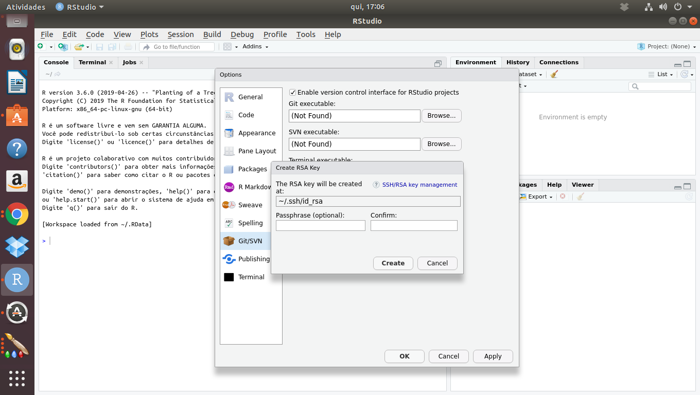
```

Copie a chave criada

```{r, out.width = "1000px", fig.align='center'}
knitr::include_graphics("Figuras/Fig13.png")
```

volte ao github e procure no menu o item "settings"

```{r, out.width = "1000px", fig.align='center'}
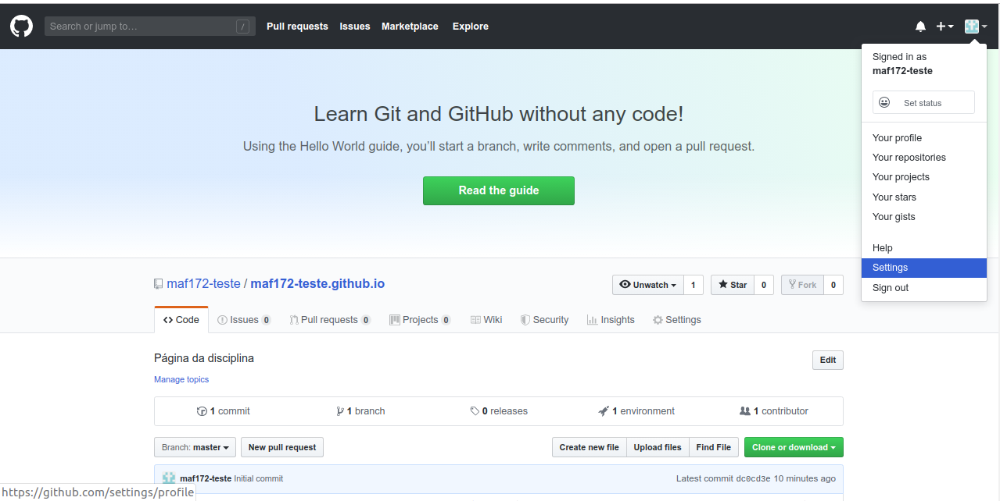
```

Clique em seguida no item "SSH and GPG keys"

```{r, out.width = "1000px", fig.align='center'}
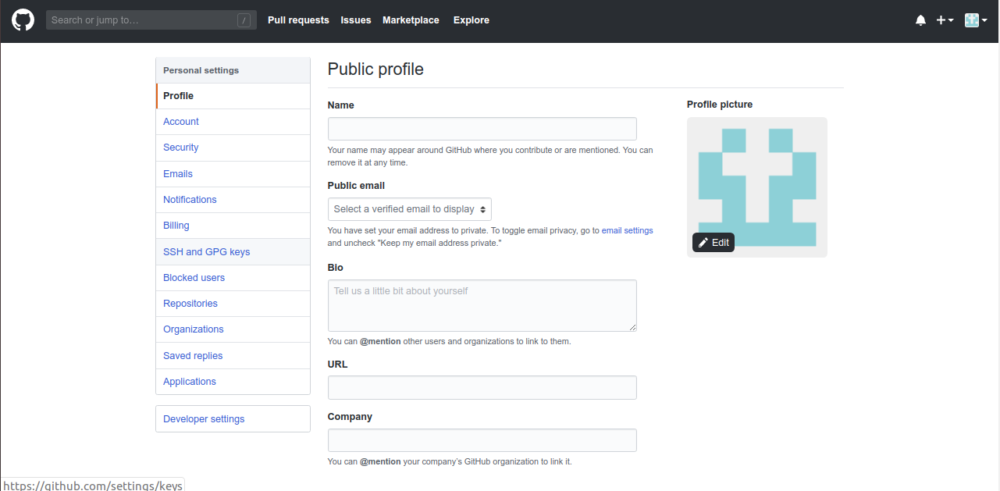
```

Clique em "New SSH Key"

```{r, out.width = "1000px", fig.align='center'}
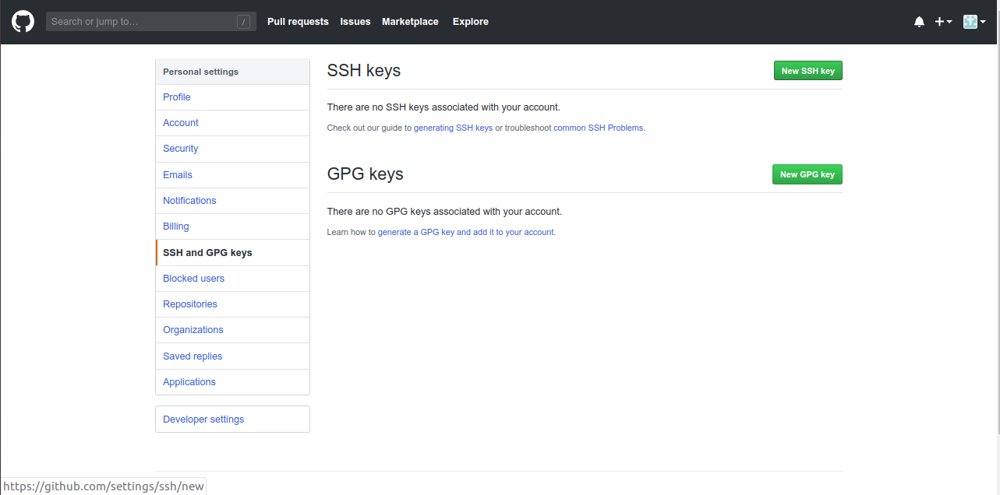
```
<p style="text-align: justify;">
Como título adicione "Rstudio" para referenciar que a chave é do Rstudio e dê um ctrl+v no espaço "key", adicionando assim a chave copiada do Rstudio. Todas as vezes que você mudar de computador e quiser adicionar arquivos do Rstudio em suas pastas do Github, você deverá refazer este passo de adicionar a chave.
</p>
```{r, out.width = "1000px", fig.align='center'}
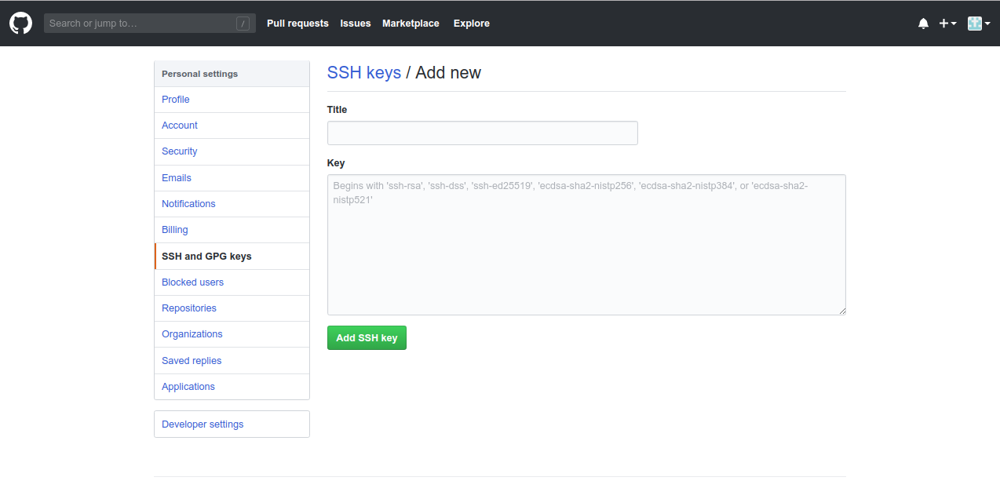
```

Aqui está a chave adicionada

```{r, out.width = "1000px", fig.align='center'}
knitr::include_graphics("Figuras/Fig18.png")
```
<p style="text-align: justify;">
Agora, vá até o seu repositório no GitHub e clique em "Clone or download", clique em seguida em "Use SSH" e copie o endereço da caixa.
</p>
```{r, out.width = "1000px", fig.align='center'}
knitr::include_graphics("Figuras/Fig19.png")
```

Volte ao Rstudio e clique em "File-->new project-->version control"

```{r, out.width = "1000px", fig.align='center'}
knitr::include_graphics("Figuras/Fig20.png")
```

clique em Git

```{r, out.width = "1000px", fig.align='center'}
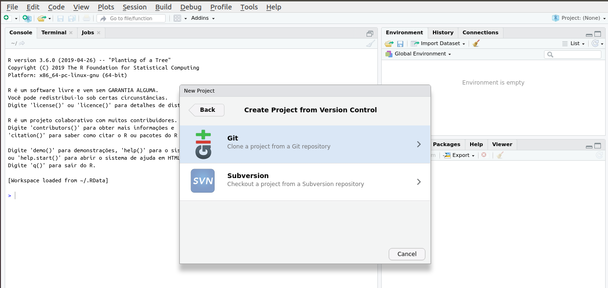
```

Cole o endereço anteriormente copiado do GitHub em "Repository URL" e clique em "create Project"

```{r, out.width = "1000px", fig.align='center'}
knitr::include_graphics("Figuras/Fig22.png")
```

Se receber um erro como o da figura abaixo, abra o git bash ou o terminal do linux e compile o código abaixo:

`ssh-keyscan -t rsa github.com >> ~/.ssh/known_hosts`

Feito isso, refaça os passos da figura 19 até a figura 22.


```{r, out.width = "1000px", fig.align='center'}
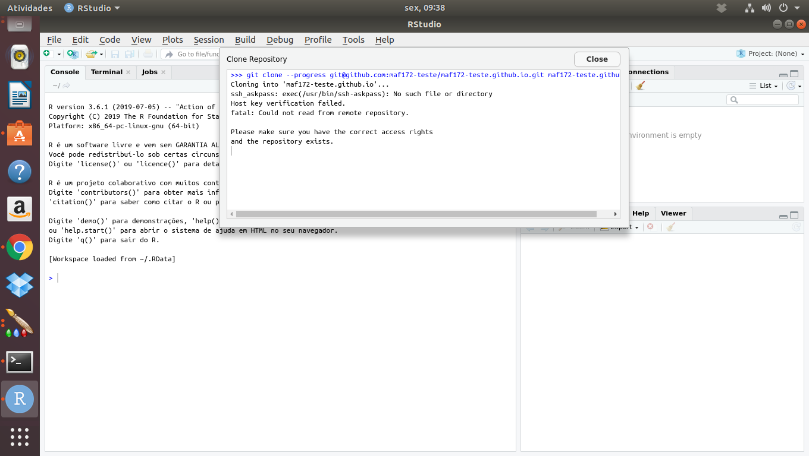
```
<p style="text-align: justify;">
Estamos quase lá. Escolha agora no site <http://jekyllthemes.org/> um modelo para sua página. Clique no modelo desejado, veja o "demo" do modelo, se realemente gostou, clique em fazer download e salve na pasta que você criou no seu computador com o nome username.github.io o arquivo .zip que você fez o download.
</p>
```{r, out.width = "1000px", fig.align='center'}
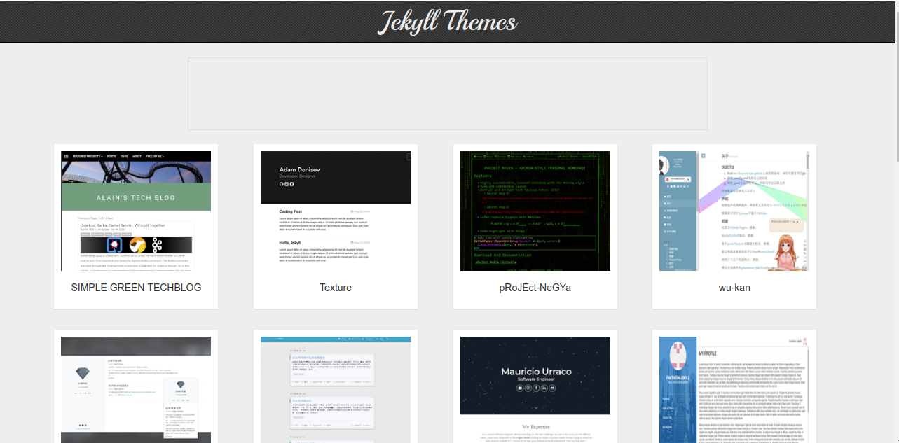
```

Para exemplificar eu escolhi o tema abaixo:

```{r, out.width = "1000px", fig.align='center'}
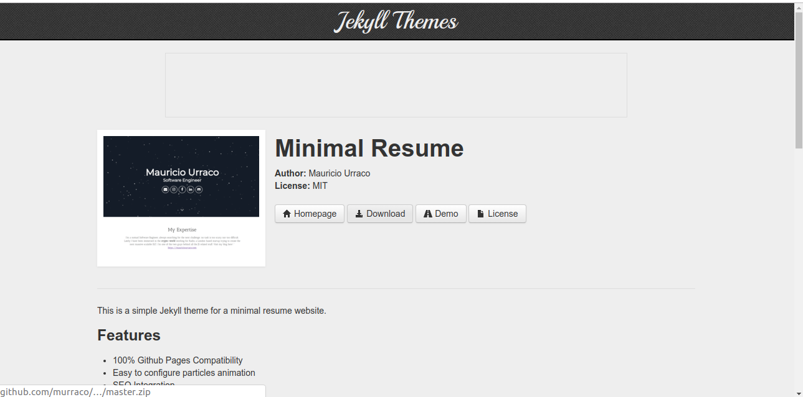
```

Fiz o download e extrair os arquivos na pasta username.github.io

```{r, out.width = "1000px", fig.align='center'}
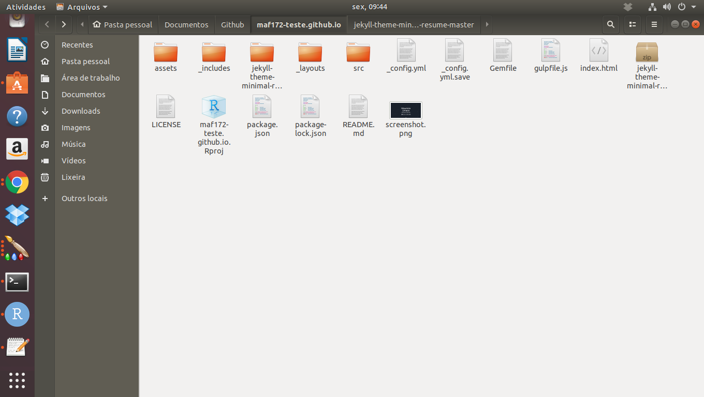
```
```{r, out.width = "1000px", fig.align='center'}
knitr::include_graphics("Figuras/Fig27.png")
```
<p style="text-align: justify;">
Feito isso, voltamos no Rstudio, vamos até a aba git que fica no lado direito junto com a aba Environment, History e Connections. Visualizamos todos os arquivos adicionados a pasta no computador, queremos agora fazer o upload destes arquivos para o GitHub, clicamos então em "commit"
</p>
```{r, out.width = "1000px", fig.align='center'}
knitr::include_graphics("Figuras/Fig28.png")
```

<p style="text-align: justify;">
Selecionamos todos os arquivos, adicionamos uma mensagem de "commit" - tal mensagem deve ser curta e deve nos remeter as alterações que estamos fazendo na pasta. Ao clicar em "commit" podemos receber a seguinte mensagem:
</p>

```{r, out.width = "1000px", fig.align='center'}
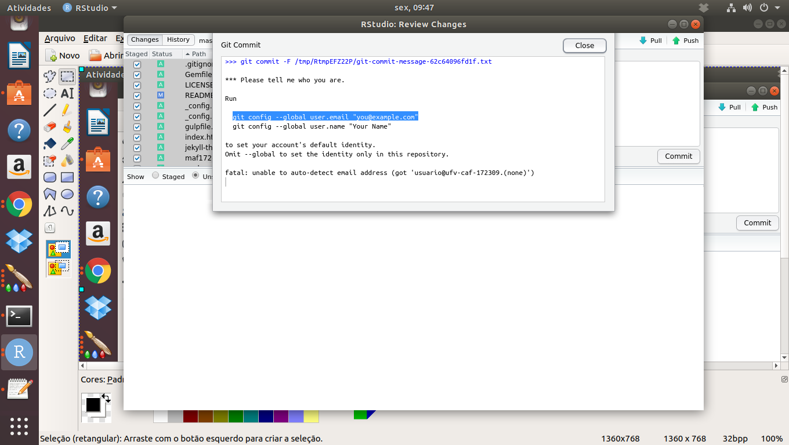
```
<p style="text-align: justify;">
Copie a primeira linha azul acima e cole no git bash ou no terminal do linux, altere a mesma adicionando o seu e-mail no lugar de "you@example.com" Posteriormente copie a segunda linha e acrescente o seu username conforme imagem abaixo.
</p>
```{r, out.width = "1000px", fig.align='center'}
knitr::include_graphics("Figuras/Fig30.png")
```

Volte ao Rstudio e proceda os comandos das figuras 27 até 29.

```{r, out.width = "1000px", fig.align='center'}
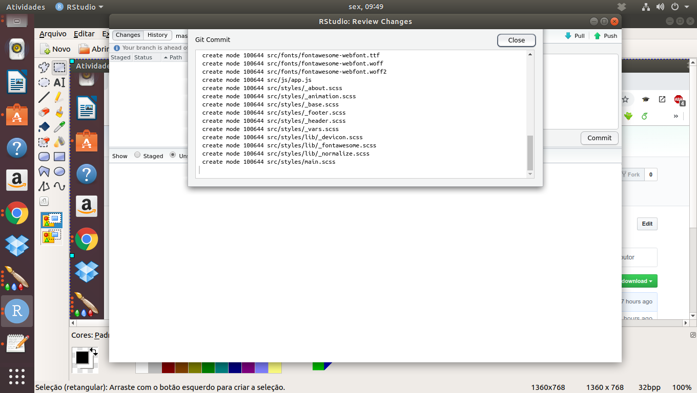
```

Dê agora um "push" e envie todos os arquivos para o GitHub.

```{r, out.width = "1000px", fig.align='center'}
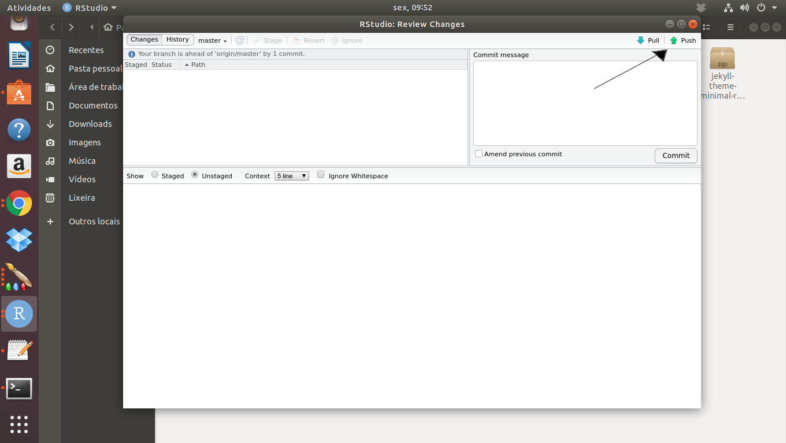
```
```{r, out.width = "1000px", fig.align='center'}
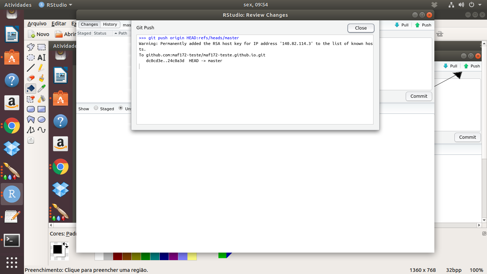
```

Atualize a página do GitHub e confirme que todos os arquivos que estavam em seu computador estão agora no Github.

```{r, out.width = "1000px", fig.align='center'}
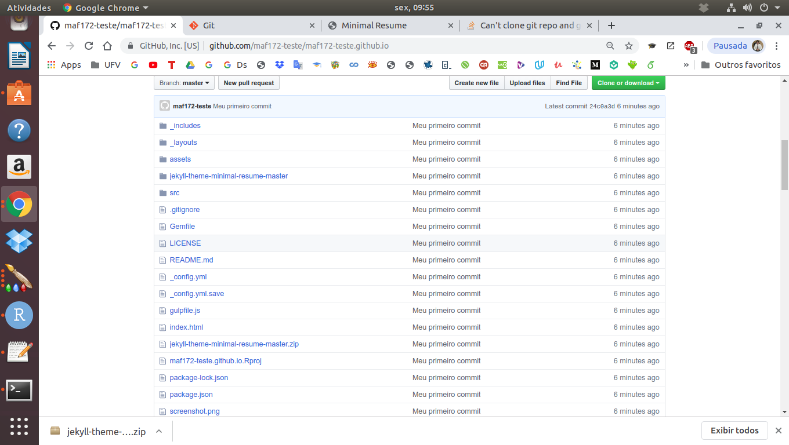
```
<p style="text-align: justify;">
Abra uma nova aba no navegador da internet e digite <Seu_username.github.io>. Se tudo tiver funcionado perfeitamente, você verá a página igual ao demo do tema que escolheu! Parabéns, essa é sua página. Você agora poderá modifica-la conforme seu desejo!
</p>
```{r, out.width = "1000px", fig.align='center'}
knitr::include_graphics("Figuras/Fig35.png")
```

Para fazer as modificações vamos continuar utilizando o Rstudio. Vá até o mesmo e abra o arquivo `_config.yml`. Modifique os nomes e as informações pertinentes.

```{r, out.width = "1000px", fig.align='center'}
knitr::include_graphics("Figuras/Fig36.png")
```

Procure também o `head.html` e o `header.html` e os modifique com suas informações.

```{r, out.width = "1000px", fig.align='center'}
knitr::include_graphics("Figuras/Fig37.png")
```

Faça um novo "commit" e um "push"

```{r, out.width = "1000px", fig.align='center'}
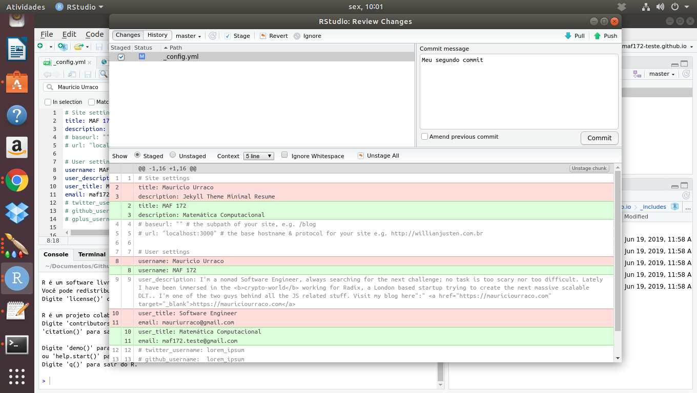
```
```{r, out.width = "1000px", fig.align='center'}
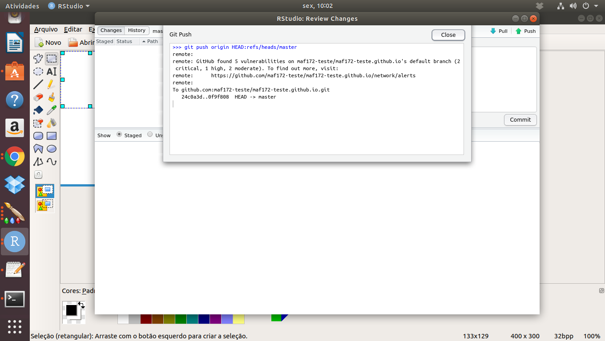
```
```{r, out.width = "1000px", fig.align='center'}

```

Aqui eu modifiquei o `about.html`

```{r, out.width = "1000px", fig.align='center'}
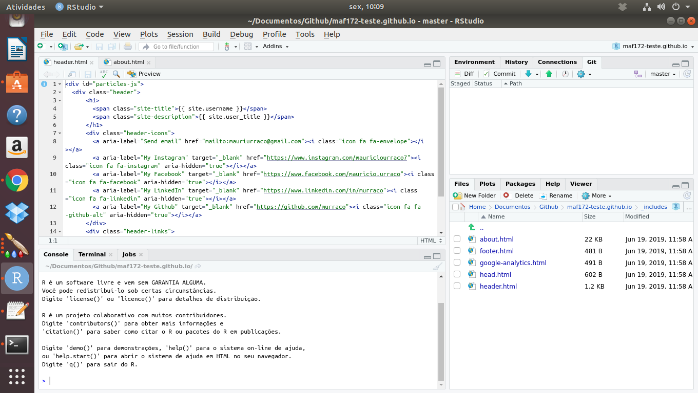
```
```{r, out.width = "1000px", fig.align='center'}
knitr::include_graphics("Figuras/Fig42.png")
```

Fiz um novo `commit` e um `push`

```{r, out.width = "1000px", fig.align='center'}
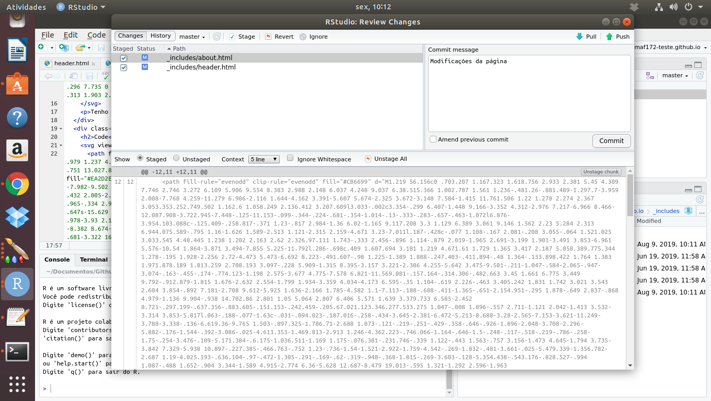
```


