```{r setup, include=FALSE}
knitr::opts_chunk$set(echo = FALSE)

```

# Preliminares
<p style="text-align: justify;">
O software R é um conjunto integrado de recursos para leitura e manipulação de dados, cálculos e exibição gráfica. O R é um programa baseado em linhas de comando. Isto é, o usuário cria uma linha de código através de uma sequência de palavras e números. Ao digitar a linha no console, o R interpreta e executa a ação codificada na linha. Também é possível informar para R, um conjunto de linhas de
uma única vez, que conhecemos como script. Ao processar o script no console, o R irá ler a primeira linha, interpretar e executar. Só depois que o processamento da primeira linha terminar, é que a segunda linha será lida, interpretada e executada. Esta sequência segue, até que todo o script tenha sido processado. 
</p>
 
<p style="text-align: justify;">
No caso do R, a linguagem utilizada recebe o mesmo nome: linguagem R. A linguagem R possui regras próprias, que chamamos de sintaxe. Estas regras precisam ser seguidas para assegurar que o programa interprete e processe as linhas com sucesso.
</p>

#

```{r, out.width = "1000px", fig.align='center'}
knitr::include_graphics("Figuras/Fig1.png")
```
```{r, out.width = "1000px", fig.align='center'}

```
```{r, out.width = "1000px", fig.align='center'}
knitr::include_graphics("Figuras/Fig3.png")
```
```{r, out.width = "1000px", fig.align='center'}
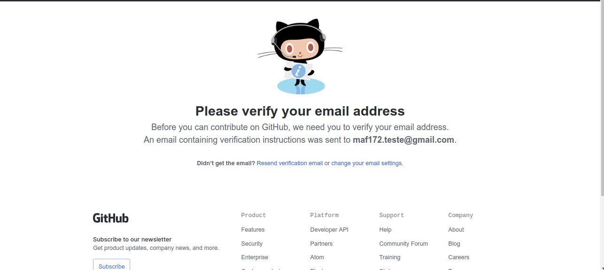
```
```{r, out.width = "1000px", fig.align='center'}
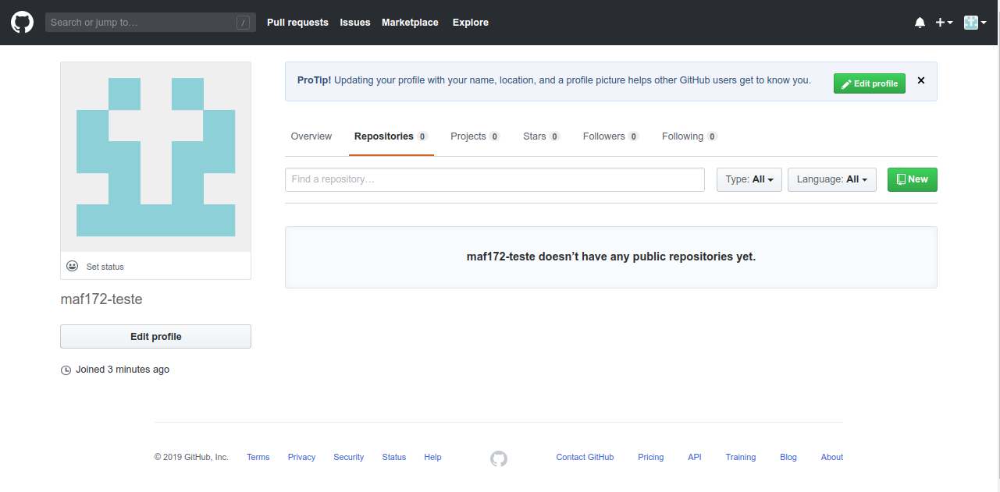
```
```{r, out.width = "1000px", fig.align='center'}
knitr::include_graphics("Figuras/Fig6.png")
```
```{r, out.width = "1000px", fig.align='center'}
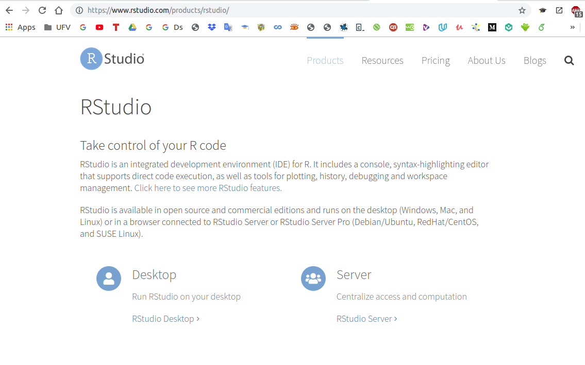
```
```{r, out.width = "1000px", fig.align='center'}
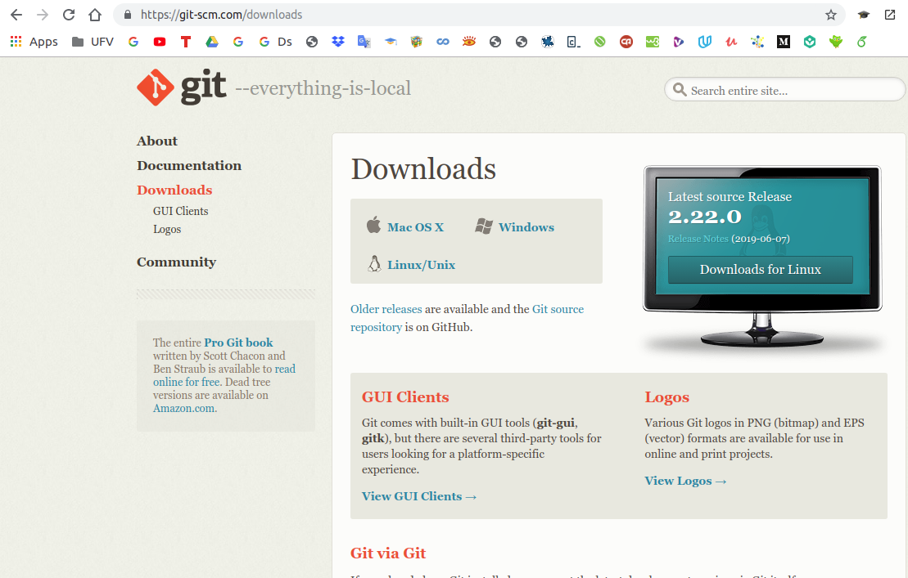
```
```{r, out.width = "1000px", fig.align='center'}
knitr::include_graphics("Figuras/Fig9.png")
```
```{r, out.width = "1000px", fig.align='center'}
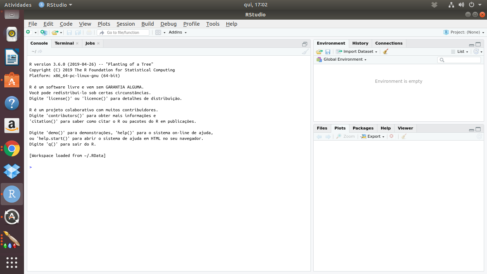
```
```{r, out.width = "1000px", fig.align='center'}
knitr::include_graphics("Figuras/Fig11.png")
```
```{r, out.width = "1000px", fig.align='center'}
knitr::include_graphics("Figuras/Fig12.png")
```
```{r, out.width = "1000px", fig.align='center'}
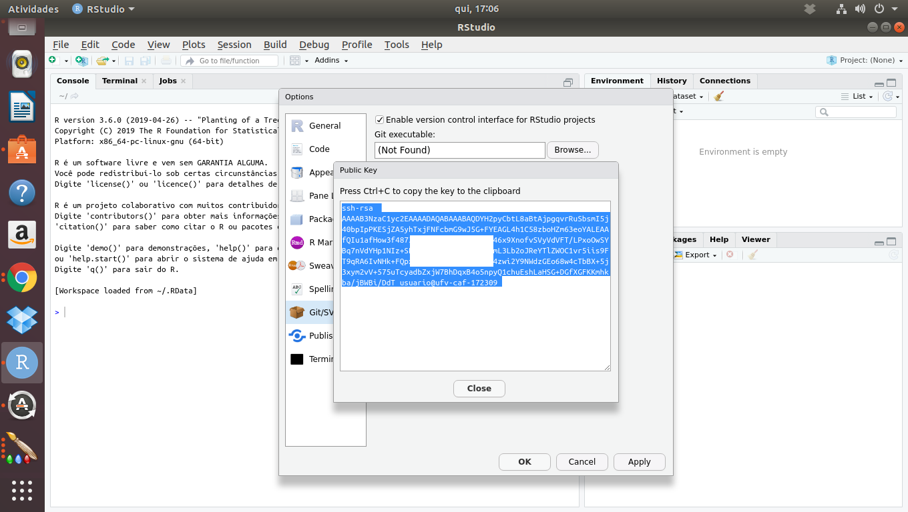
```
```{r, out.width = "1000px", fig.align='center'}
knitr::include_graphics("Figuras/Fig14.png")
```
```{r, out.width = "1000px", fig.align='center'}
knitr::include_graphics("Figuras/Fig15.png")
```
```{r, out.width = "1000px", fig.align='center'}
knitr::include_graphics("Figuras/Fig16.png")
```
```{r, out.width = "1000px", fig.align='center'}
knitr::include_graphics("Figuras/Fig17.png")
```
```{r, out.width = "1000px", fig.align='center'}
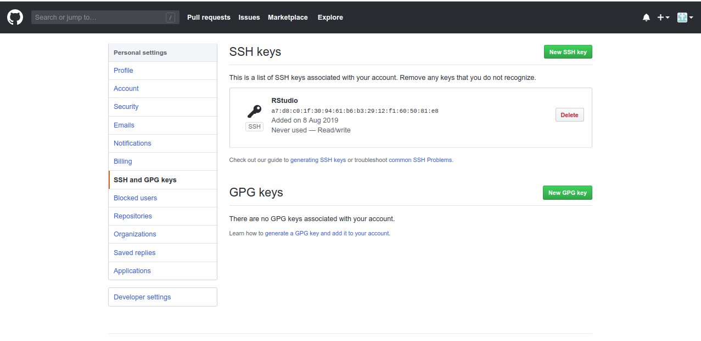
```
```{r, out.width = "1000px", fig.align='center'}
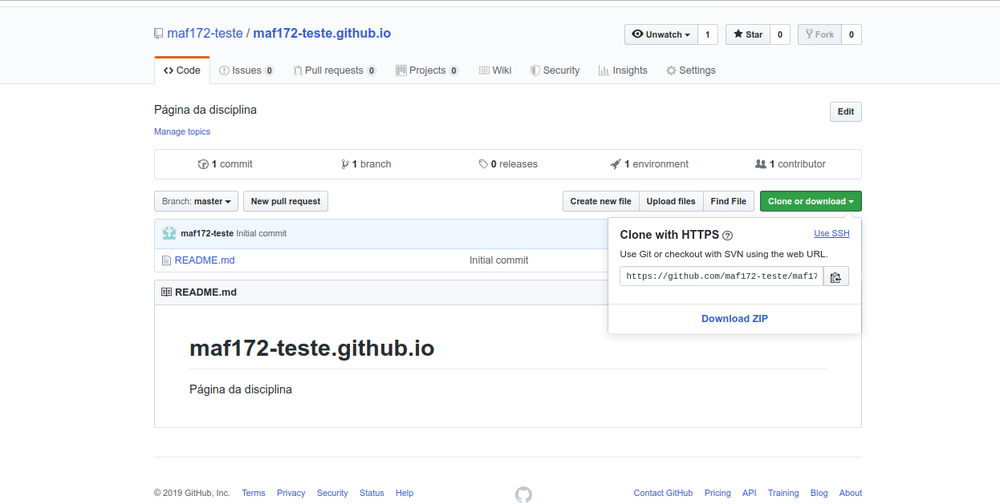
```
```{r, out.width = "1000px", fig.align='center'}
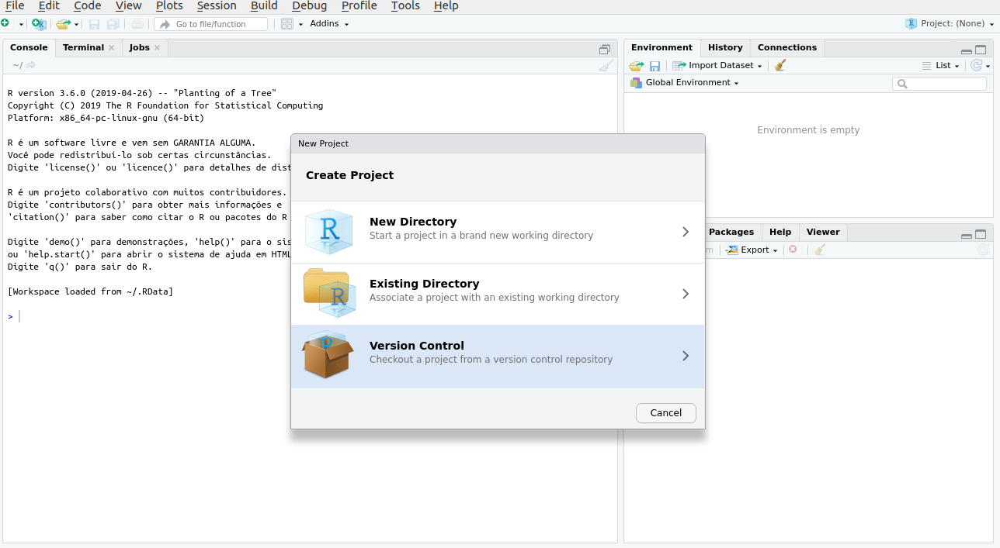
```
```{r, out.width = "1000px", fig.align='center'}
knitr::include_graphics("Figuras/Fig21.png")
```
```{r, out.width = "1000px", fig.align='center'}
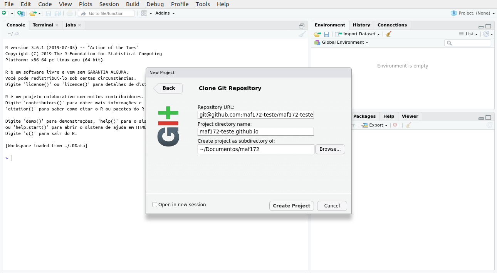
```
```{r, out.width = "1000px", fig.align='center'}
knitr::include_graphics("Figuras/Fig23.png")
```
```{r, out.width = "1000px", fig.align='center'}
knitr::include_graphics("Figuras/Fig24.png")
```
```{r, out.width = "1000px", fig.align='center'}
knitr::include_graphics("Figuras/Fig25.png")
```
```{r, out.width = "1000px", fig.align='center'}
knitr::include_graphics("Figuras/Fig26.png")
```
```{r, out.width = "1000px", fig.align='center'}
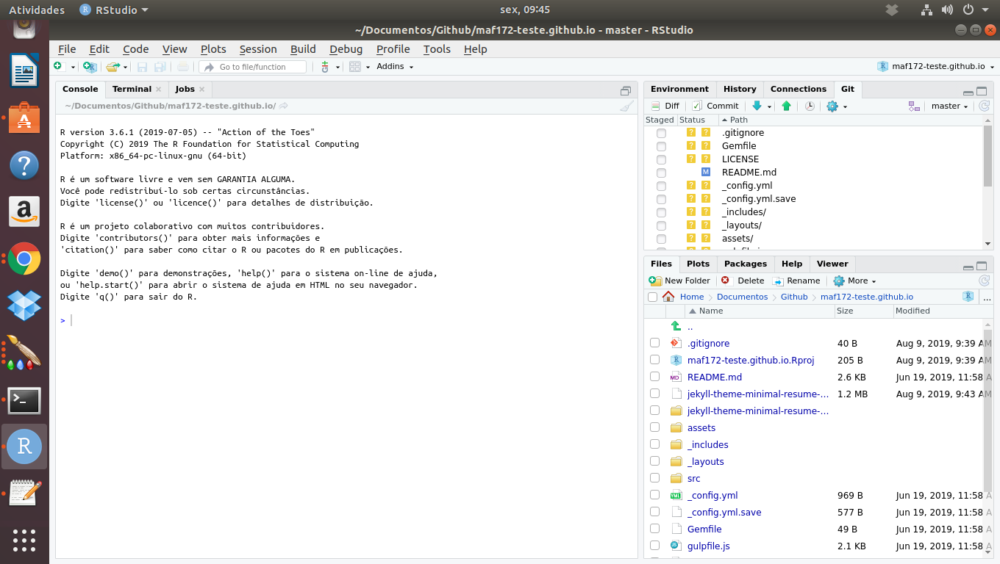
```
```{r, out.width = "1000px", fig.align='center'}
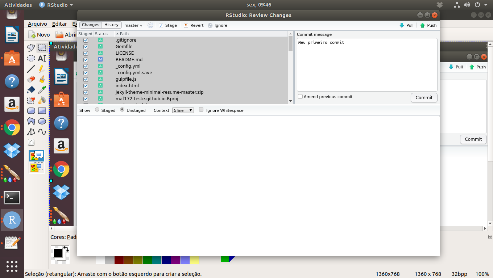
```
```{r, out.width = "1000px", fig.align='center'}
knitr::include_graphics("Figuras/Fig29.png")
```
```{r, out.width = "1000px", fig.align='center'}
knitr::include_graphics("Figuras/Fig30_1.png")
```
```{r, out.width = "1000px", fig.align='center'}
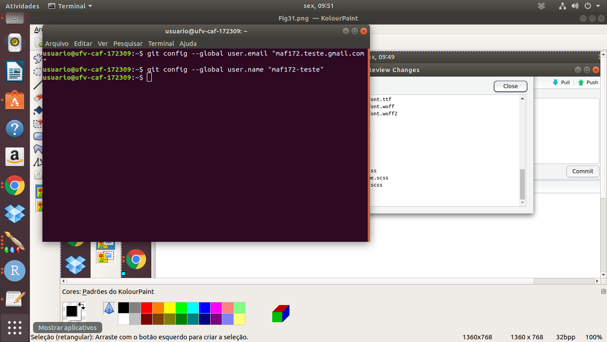
```
```{r, out.width = "1000px", fig.align='center'}
knitr::include_graphics("Figuras/Fig31.png")
```
```{r, out.width = "1000px", fig.align='center'}
knitr::include_graphics("Figuras/Fig32.png")
```
```{r, out.width = "1000px", fig.align='center'}
knitr::include_graphics("Figuras/Fig33.png")
```
```{r, out.width = "1000px", fig.align='center'}
knitr::include_graphics("Figuras/Fig34.png")
```
```{r, out.width = "1000px", fig.align='center'}

```
```{r, out.width = "1000px", fig.align='center'}
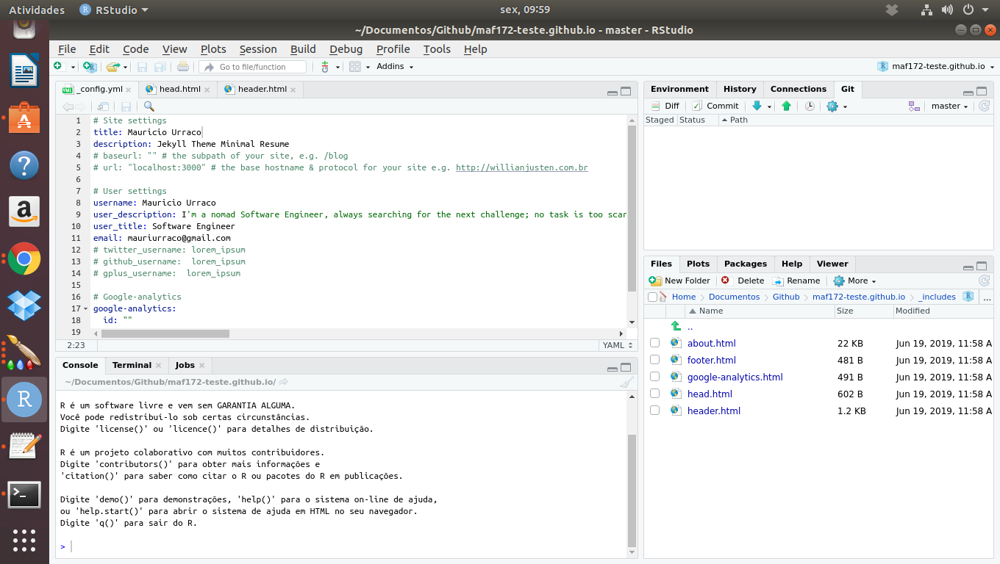
```
```{r, out.width = "1000px", fig.align='center'}
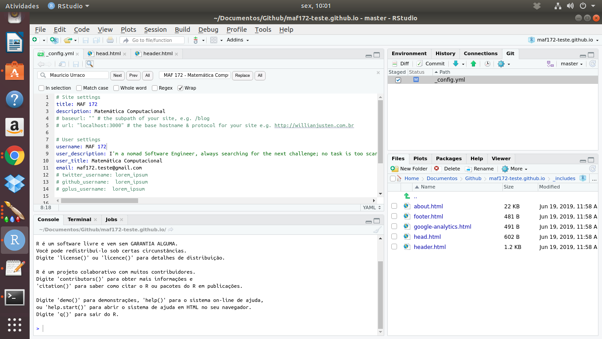
```
```{r, out.width = "1000px", fig.align='center'}
knitr::include_graphics("Figuras/Fig38.png")
```
```{r, out.width = "1000px", fig.align='center'}
knitr::include_graphics("Figuras/Fig39.png")
```
```{r, out.width = "1000px", fig.align='center'}
knitr::include_graphics("Figuras/Fig40.png")
```
```{r, out.width = "1000px", fig.align='center'}
knitr::include_graphics("Figuras/Fig41.png")
```
```{r, out.width = "1000px", fig.align='center'}
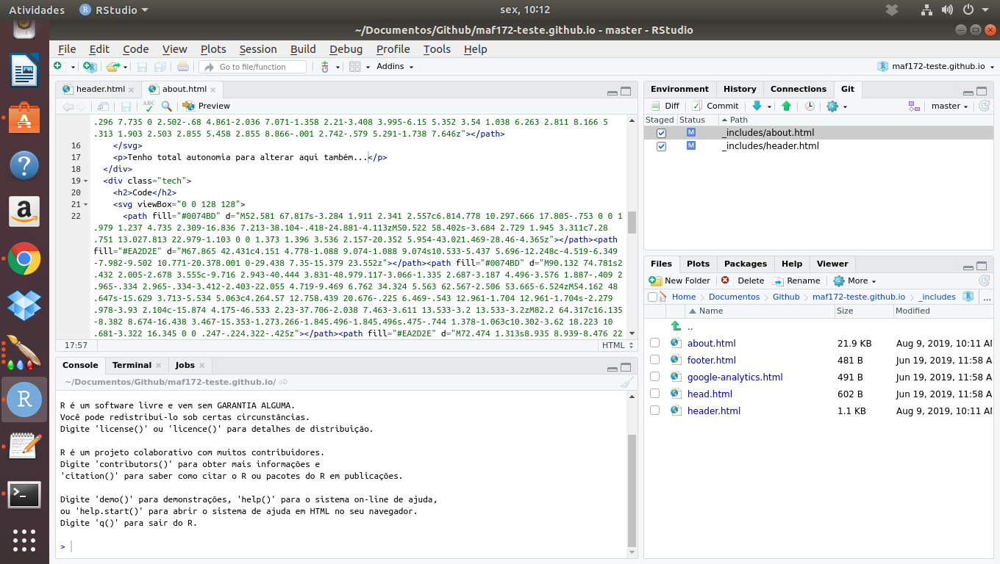
```
```{r, out.width = "1000px", fig.align='center'}
knitr::include_graphics("Figuras/Fig43.png")
```


# Referências e recomendações

[curso-r:](https://www.curso-r.com/) Descomplicando a ciência de dados. Site e blog com muito material. Os integrantes são extremamente pró-ativos.

[RPubs.](https://rpubs.com/EstatBasica/Introd) Comandos R para análises estatísticas de exercicíos e teoria do livro Estatística Básica(Bussab e Morettin, 2013) 

[Oliveira, P. F., Guerra, S., McDonnell, R.](https://cdr.ibpad.com.br/cdr-intro.pdf) **Ciência de dados com R: Introdução** – Brasília: Editora IBPAD, 2018. (Livro muito bom e gratuito) 