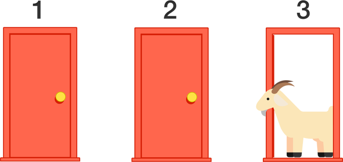

```{r setup, include=FALSE}
knitr::opts_chunk$set(echo = TRUE)
```
<div style='text-align:justify;'>
# JOGO DAS PORTAS



### OBJETIVO:

 Adivinhar atrás de qual porta está o prêmio (carro).
 

### COMPONENTES DO JOGO:

Trios de portas contendo um carro e dois bodes em
cada.

### REGRAS:

1. O jogador deve escolher uma porta entre três disponíveis.

2. Atrás de uma porta há um carro, enquanto atrás de cada uma das outras há um
bode.

3. Após a escolha, o aplicador do jogo elimina uma porta com um bode e faz uma
pergunta ao jogador: “Você deseja trocar sua porta?”

4. O jogador decide se permanece com a porta escolhida e a abre para ver o seu
“prêmio” ou se troca de porta.

#### A questão é: Qual é a melhor estratégia para ter maior chance de escolher a porta que oculta o carro?

### DISCUSSÃO:

Uma resposta bastante comum ao problema é que quando o aplicador revelou uma
das portas não-premiada, o jogador passaria a ter à frente um novo dilema, com
apenas duas portas e um prêmio, portanto as chances do prêmio estar em qualquer
uma das duas portas passaria a ser de 1/2. O aplicador teria ajudado o jogador, já
que a probabilidade de acertar subiu de 1/3 para 1/2, no entanto não faria
diferença trocar ou não de porta, uma vez que ambas teriam chance 1/2 de
possuírem o prêmio.


No entanto, esta análise é errada, pois a porta que o aplicador abre depende da
porta que o jogador escolheu inicialmente. O aplicador sabe desde o começo onde
está o prêmio e assim ele nunca abrirá uma porta premiada. Ao abrir uma porta
não premiada, ele não está criando um jogo novo, mas está dando informações
valiosas ao jogador sobre a localização do prêmio definida no jogo inicial.
Uma análise relativamente simples nos dá a probabilidade de ser conveniente
trocar de porta. De fato, só não seria vantajoso trocar se atrás da porta escolhida
pelo jogador estivesse o carro. Isto ocorre com probabilidade 1/3 pois o carro tem
a mesma probabilidade de estar atrás de qualquer uma das três portas. Portanto, a
probabilidade de ser vantajoso trocar de porta será 2/3.


É bom ressaltar que este resultado é um valor de **probabilidade**, portanto ele não garante que você vai ganhar trocando de porta. Na verdade o que ele permite
afirmar é que se você jogar muitas vezes, em aproximadamente 67% das vezes se
você trocar de porta, ganhará o prêmio. Obviamente isto não é útil para ganhar o
prêmio se jogarmos apenas uma vez. Por isso na explicação da atividade é
conveniente repetir a situação várias vezes e calcular a proporção de vezes que o jogador ganhou trocando de porta.

### BIBLIOGRAFIA:

O jogo está baseado num problema matemático que surgiu a partir de um concurso
televisivo dos Estados Unidos chamado Let’s Make a Deal, exibido na década de
1970. O problema é chamado de Problema de Monty Hall (o apresentador) e está
abundantemente documentado na internet. Uma referência interessante é o artigo
da Wikipédia em português: https://pt.wikipedia.org/wiki/Problema_de_Monty_Hall
</div>